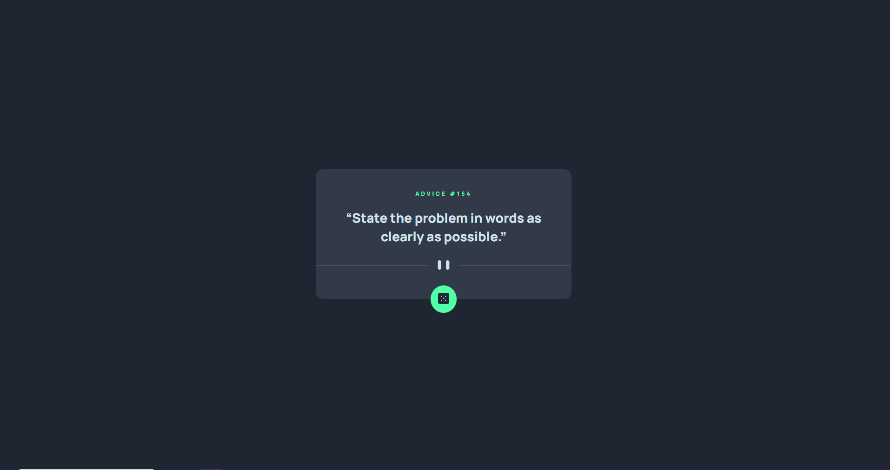

# Frontend Mentor - Advice generator app solution

This is a solution to the [Advice generator app challenge on Frontend Mentor](https://www.frontendmentor.io/challenges/advice-generator-app-QdUG-13db). Frontend Mentor challenges help you improve your coding skills by building realistic projects.

## Table of contents

- [Overview](#overview)
  - [The challenge](#the-challenge)
  - [Screenshot](#screenshot)
  - [Links](#links)
- [Built with](#built-with)
- [Author](#author)

## Overview

### The challenge

Users should be able to:

- View the optimal layout for the app depending on their device's screen size
- See hover states for all interactive elements on the page
- Generate a new piece of advice by clicking the dice icon

### Screenshot

### Links

- Solution URL: [Solution URL](https://www.frontendmentor.io/solutions/advice-generator-app-using-basic-html-css-and-js-UTDlB5j95_)
- Live Site URL: [Live site URL](https://alencarftc.github.io/fm-advice-generator-app)

## Built with

- Semantic HTML5 markup
- CSS custom properties
- Javascript
- Flexbox
- Mobile-first workflow

## Author

- Website - [Felipe Alencar](https://fecasti.tech)
- Frontend Mentor - [@alencarftc](https://www.frontendmentor.io/profile/alencarftc)
